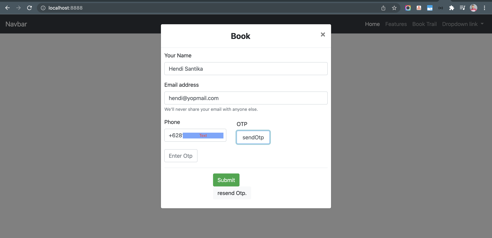

# spring-boot-twilio-otp-sms-demo

### Things todo list:

1. Clone this repository: `git clone https://github.com/hendisantika/spring-boot-twilio-otp-sms-demo.git`
2. Navigate to the folder: `cd spring-boot-twilio-otp-sms-demo`
3. Change Twilio configuration with your own credentials.
4. Run the application: `mvn clean spring-boot:run`
5. Open your favorite browser: http://localhost:8888

### Image Screen shot

Send OTP Page

Verified Page

